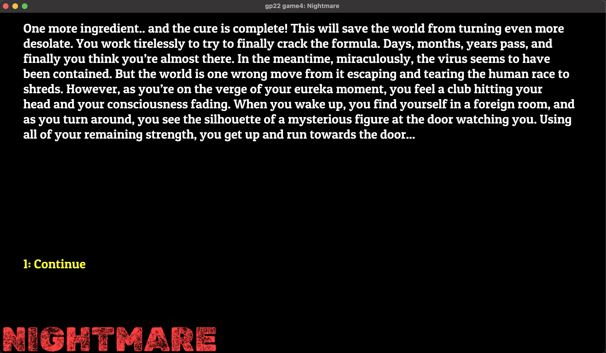

# Nightmare

**Author:** Jason Xu, Ashley Kim, and Will Ozeas

**Design:** Our game is a puzzle-text adventure, where you must use information 
from previous runs of the game to survive a zombie-infested lab! Further spoiler details are in WALKTHROUGH.txt.

**Text Drawing:** Our text drawing is computed at runtime. This choice was made to have user's input also render on screen in real-time, making the game more interactive.

 The text to be rendered is first parsed from respective `dist/room#.txt` file and each portion of the text is saved as a separate field in the `current_room` struct. (Checkout `RoomParser.hpp` and `RoomParser.cpp`) Then the function `renderWrappedText()` is called to render each portion of the text at a defined location on the screen. (Checkout `TextRendering.hpp` and `TextRendering.cpp`)

**Choices:** Every screen is stored as a .txt file. Each file starts with the main text, then uses brackets to denote a choice, followed by
a file name in parentheses. Our code will parse this text automatically and gives us a vector of choices to render and a map of text entries
to file names, and if matching text is entered, the corresponding file is loaded.

Screen Shot:

## How To Play: ##

At each screen, you may type in text and then hit enter to move rooms. Numbers indicate choices, but that's not all you can type...

## Special Things: ##
* User Input + real-time render of user input text on screen
* Multi-line auto text wrap on screen
* Non-linear storyline with special command inputs
* Text parsing program to separate main text, choice options, and filename to be called upon selection of a choice
* Rendering functions that support multiple font families, sizes, color, and location, as well as text fade-in.
* A secret ending, if you can find it!

## Sources & References ##
**Sources:**
* Roboto Medium font from https://fonts.google.com/specimen/Roboto/about?query=roboto

* Rubik Dirt font from rom https://fonts.google.com/specimen/Rubik+Dirt/about?query=rubik

* Patua One font from https://fonts.google.com/specimen/Patua+One/about?query=patua+one

**Reference:**
* [Harfbuzz](https://github.com/harfbuzz/harfbuzz-tutorial/blob/master/hello-harfbuzz-freetype.c)
* [FreeType](https://freetype.org/freetype2/docs/tutorial/step1.html#section-6)
* [OpenGL](https://learnopengl.com/In-Practice/Text-Rendering)

Code file itself also has annotations for specific parts and references we used.

This game was built with [NEST](NEST.md).

